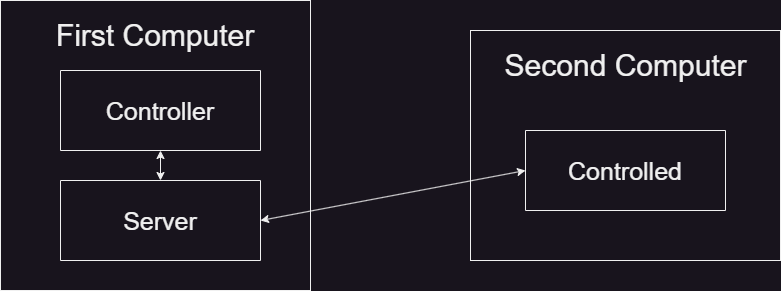
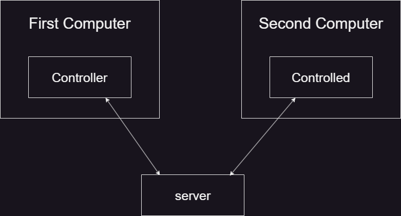
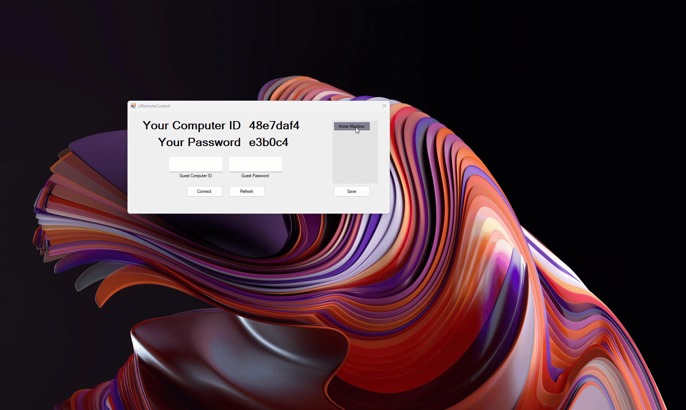

<h1>URemoteControl</h1>
Free and open source remote control software

<h2>Build Requirements</h2>
- Microsoft [Visual Studio](https://visualstudio.microsoft.com/free-developer-offers/) + MSVC + C# compiler and build toos 
- [Python 3.9](https://www.python.org/downloads/) of higher 
- Uvicorn library - ```pip install uvicorn``` 
- Fast Api library - ```pip install fastapi```
- [Go compiler](https://go.dev)
- [vcpkg](https://vcpkg.io/en/getting-started.html)

<h2>Build</h2>
- Open Visual Studio 2022 Developer Command Prompt
- Run ```vcpkg install zlib:x64-windows``` 
- ```cd``` into the build folder in the project root directory. 
- ```namke build.make```

<h2>Install from source and run</h2>

<h3>On Server Machine</h3>
- Install [python 3.9](https://www.python.org/downloads/) or higher
- ```pip install uvicorn``` 
- ```pip install fastapi```
- ```python3  main.py```

<h3>On Controlled Machine</h3>
- Run ```ControllerSetup.cmd``` as administrator
- Edit ```config.ini``` file and set ```http_server_url``` and```main_server_address``` fields to contain the server ip address
- Run ```sc start URemoteControlService```

<h3>On Controller Machine</h3>
- Run ```ControllerSetup.cmd```
- Edit ```config.ini``` file and set ```http_server_url``` and```main_server_address``` fields to contain the server ip address
- Run ```URemoteControlGUI.exe```

<h2>Controller App</h2>
While controlling another PC You can enter/exit "control mode" by pressing the ```ctrl + space``` keys. \
While in control mode you can switch screens by pressing the apper number keys. \
You can't control the mouse or the keyboard while in control mode

<h2>Configurations</h2>
There are two deployment configurations the program can run in

<h3>First configuration (LAN)</h3>


<h3>Second configuration (Internet Server)</h3>


<h2>Future Goals</h2>
- Implement the software for other platforms 
- Implementing the controller for wasm 
- Add GPU support for capturing and stretching the current monitor image 
- Implement into the GPU pixel shader/fragment shader the bitmaps comparison




