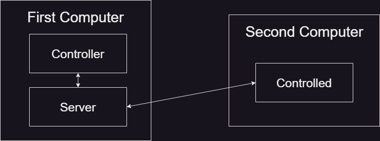
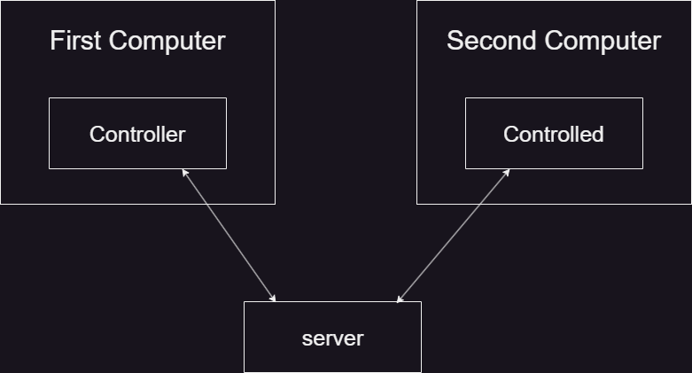
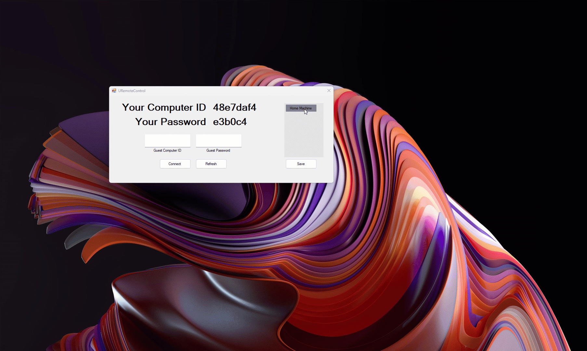

<h1>URemoteControl</h1>
Free and open source remote control software

<h2>Build Requirements</h2>
- Microsoft [Visual Studio](https://visualstudio.microsoft.com/free-developer-offers/) + MSVC + C# compiler and build toos 
- [Python 3.9](https://www.python.org/downloads/) of higher 
- Uvicorn library - ```pip install uvicorn``` 
- Fast Api library - ```pip install fastapi```
- [Go compiler](https://go.dev)
- [vcpkg](https://vcpkg.io/en/getting-started.html)

<h2>Build</h2>
- Open Visual Studio 2022 Developer Command Prompt
- Run ```vcpkg install zlib:x64-windows openssl:x64-windows``` 
- ```cd``` into the build folder in the project root directory. 
- ```nmake build.make```

<h2>Install from source and run</h2>

<h3>On Server Machine</h3>
- Install [python 3.9](https://www.python.org/downloads/) or higher
- ```pip install uvicorn``` 
- ```pip install fastapi```
- ```python3  main.py```

<h3>On Controlled Machine</h3>
- Run ```ControllerSetup.cmd``` as administrator
- Edit ```config.ini``` file and set ```http_server_url``` and```main_server_address``` fields to contain the server ip address
- Run ```sc start URemoteControlService```

<h3>On Controller Machine</h3>
- Run ```ControllerSetup.cmd```
- Edit ```config.ini``` file and set ```http_server_url``` and```main_server_address``` fields to contain the server ip address
- Run ```URemoteControlGUI.exe```

<h2>Controller App</h2>
While controlling another PC You can enter/exit "control mode" by pressing the ```ctrl + space``` keys. \
While in control mode you can switch screens by pressing the apper number keys. \
You can't control the mouse or the keyboard while in control mode

<h2>TLS Encryption</h2>
TLS encryption for screen and input data is supported. To enable:

<h3>Server (Go)</h3>
- Generate a certificate: run ```Server\generate_cert.bat``` (requires OpenSSL in PATH)
- Set environment variables before starting the server:
  - ```UREMOTE_TLS_CERT``` - path to server certificate (.crt)
  - ```UREMOTE_TLS_KEY``` - path to server private key (.key)

<h3>Clients (Controller and Controlled)</h3>
Add to ```config.ini``` in the [config] section:
- ```use_tls=1``` - enable TLS
- ```tls_server_name=localhost``` - server hostname for SNI (use server address or hostname from cert)
- ```tls_ca_cert_path=path\to\server.crt``` - path to CA cert or server cert for verification (leave empty to use system CA store)
- ```allow_remote_keyboard_control=0``` - disable applying remote keyboard events on the controlled PC
- ```allow_remote_mouse_control=0``` - disable applying remote mouse events on the controlled PC

Both input flags default to ```0``` when missing.

<h2>End-to-End Encryption</h2>
On top of (optional) TLS to the server, the clients can encrypt the screen and
input payloads end-to-end with **AES-256-GCM**, so the relay server only ever
forwards ciphertext and can never read the data. Set the **same** secret on both
clients in ```config.ini``` (```[config]``` section):
- ```e2e_key=your-strong-shared-secret``` — enables E2E when non-empty (leave empty to disable).

The key is derived with PBKDF2-HMAC-SHA256; a fresh random nonce is used per
frame. The Go server needs no configuration for this — it stays a blind relay.
See [CHANGES_E2E_DEBUG.md](CHANGES_E2E_DEBUG.md) for full details.

<h2>Debug mode and running locally</h2>
Set ```debug_mode=1``` in ```config.ini``` to test safely (including both clients
on one machine) without losing your mouse/keyboard: the controller does not
capture/forward input or trap the cursor, the controlled side never applies
remote input, and the controller window opens windowed (non full screen). The
remote screen is still displayed.

Run the whole stack (Go server + both clients) locally:
- ```powershell -ExecutionPolicy Bypass -File .\scripts\run-debug.ps1 -BuildFirst```
- Stop it: ```powershell -ExecutionPolicy Bypass -File .\scripts\stop-debug.ps1```

<h2>Build and run C apps</h2>
- Build all C/C++ projects from VS Code or terminal:
  - ```powershell -ExecutionPolicy Bypass -File .\scripts\build-c-apps.ps1 -Configuration Debug```
- Run controller app:
  - ```powershell -ExecutionPolicy Bypass -File .\scripts\run-c-app.ps1 -App controller -ServerAddress 127.0.0.1 -ServerPort 80```
- Run controlled app:
  - ```powershell -ExecutionPolicy Bypass -File .\scripts\run-c-app.ps1 -App controlled -ServerAddress 127.0.0.1 -ServerPort 80```

You can also use the VS Code Run/Debug entries:
- ```Build C Apps```
- ```Run C Controller App```
- ```Run C Controlled App```

<h2>Configurations</h2>
There are two deployment configurations the program can run in

<h3>First configuration (LAN)</h3>


<h3>Second configuration (Internet Server)</h3>


<h2>Future Goals</h2>
- Implement the software for other platforms 
- Implementing the controller for wasm 
- Add GPU support for capturing and stretching the current monitor image 
- Implement into the GPU pixel shader/fragment shader the bitmaps comparison




